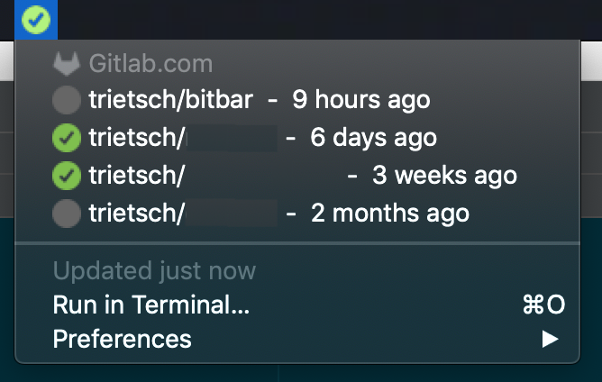

# Bitbar scripts
This repo contains my personal Bitbar scripts.

## Installation
The following steps are required to run Bitbar scripts (that use Python):
1. Ensure that Bitbar is installed: `brew cask install bitbar`
1. Open Bitbar and choose `/scripts` as the Bitbar Plugin Folder.
1. Copy the scripts you want to enable `scripts/template` to `scripts`
1. Make sure you have Python 3 installed (tested with `3.7.4`): `brew install python3`
1. For the modules below, you need to install some Python dependencies: `pip install timeago python-dateutil requests azure-devops`
1. In order to use a module, copy the template config (found in `config/<module-name>.template`) to a `.ini` file (`config/<module-name>.ini`), e.g.: `cp config/bitbucket-config.template config/bitbucket-config.ini`. **Important**, ensure that you've set the path to the python binary as part of the config file.

## Update 10-02-2020
1. Copy the scripts you want to enable `scripts/template` to `scripts`
1. Install `azure-devops` with `pip` if you want to use the Azure Devops module
1. Add the `[python]` section with the path to the Python binary in each `.ini` file you already created
1. Create an `azure_devops-config.ini` file if you want to to use that module

## Modules
### Gitlab
Integrates with (multiple) Gitlab hosts and shows the status like CCMenu does. At the moment, Gitlab does not offer a `cc.xml` that Jenkins does, so this is a workaround.



To change the settings, copy the `.gitlab-config.template.ini` to `.gitlab-config.ini` and adjust to your own preferences. By default, only projects are included that you've starred and of which you're a member. So if you don't change that behavior, go to the Gitlab instances and star the projects that you want to see.

#### Improvements
Add notifications, overwriting each run result in a pickle file, in order to compare whether checkins have fixed the build, whether there was another successful build, etc.

### Bitbucket PRs
Show open PRs in a Bitbucket instance with a status whether you've still got PRs to review.


To change the settings, copy the `.bitbucket-config.template` to `.bitbucket-config.ini` and adjust to your own preferences. PRs that you have marked as approved can be omitted, by setting the value in the configuration.

## FAQ

Q: I'm unable to install Python 3.6.0 due to `zlib` and errors while building Python 3.6.0.

A:
- Run `brew install zlib`
- Add the following to your `.bash_profile`, `.bashrc`, `.zprofile`, `.zshrc`, or similar:
```
# zlib
# For compilers to find zlib you may need to set:
export LDFLAGS="-L/usr/local/opt/zlib/lib"
export CPPFLAGS="-I/usr/local/opt/zlib/include"

# For pkg-config to find zlib you may need to set:
export PKG_CONFIG_PATH="/usr/local/opt/zlib/lib/pkgconfig"
```
- Run `brew uninstall --ignore_dependencies openssl && brew install openssl && CFLAGS="-I$(brew --prefix openssl)/include" LDFLAGS="-L$(brew --prefix openssl)/lib" pyenv install 3.6.0` to successfully install Python 3.6.0. After that, you can run the `pip install` commands.

### Azure DevOps
Show open PRs in an Azure Devops organization with a status whether you've still got PRs to review.
To change the settings, copy the `.bitbucket-config.template` to `.bitbucket-config.ini` and adjust to your own preferences. PRs that you have marked as approved can be omitted, by setting the value in the configuration.
