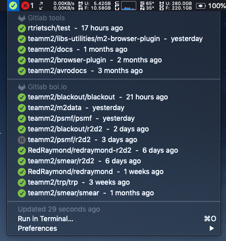

# Bitbar scripts

## Installation
To install Bitbar, run:

`brew cask install bitbar`

After installation, open Bitbar and choose this repo location as the Bitbar Plugin Folder.

## Modules

### Gitlab
Integrates with (multiple) Gitlab hosts and shows the status like CCMenu does. At the moment, Gitlab does not offer a `cc.xml` that Jenkins does, so this is a workaround.

**Note**: bugs may still exist.

To change the settings, copy the `.gitlab-config.template.ini` to `.gitlab-config.ini` and adjust to your own preferences. By default, only projects are included that you've starred and of which you're a member. So if you don't change that behavior, go to the Gitlab instances and star the projects that you want to see.

**Important**: change the hashbang at the top of the file, to point to a Python 3 executable if the generic hashbang doesn't work for you. I've tried to create a hashbang that just looks at the default location that `pyenv` is installed

#### Dependencies

If you want to use the current hashbang at the top of the file, make sure you've got `pyenv` installed:

- `brew install pyenv`
- `pyenv install 3.6.0`

Install the following Python packages (`pip install ...`):
- timeago
- python-dateutil
- requests

#### Improvements

Add notifications, overwriting each run result in a pickle file, in order to compare whether checkins have fixed the build, whether there was another successful build, etc.