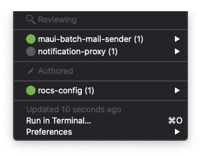

# xbar (previously BitBar) scripts
This repo contains my personal [xbar](https://github.com/matryer/xbar) scripts. Feel free to use, fork, modify, or tweak them to meet your needs! If you find any issues, you can report them in this Gitlab project. Merge requests are appreciated.

Note that these scripts (probably) also work with [argos](https://github.com/p-e-w/argos) and [kargos](https://github.com/lipido/kargos) for Unix systems.

## Installation
The following steps are required to run xbar scripts (that use Python):
1. Ensure that xbar (or kargos) is installed: `brew cask install xbar` or follow the installation instructions for the application that can run xbar scripts.
1. Open xbar and choose `/scripts` as the xbar Plugin Folder.
1. Copy the scripts you want to enable `scripts/template` to `scripts`, and make sure to remove `.template` from the filename.
1. Make sure you have Python 3 installed (tested with `3.7.4`): `brew install python3`
1. For the modules below, you need to install some Python dependencies: `pip install -r requirements.txt`
1. In order to use a module, copy the template config (found in `config/template/<module-name>.template`) to `config/<module-name>.ini`, e.g.: `cp config/template/bitbucket-config.template config/bitbucket-config.ini`.

## Scripts
### Gitlab
Integrates with (multiple) Gitlab hosts and shows the status like CCMenu does. At the moment, Gitlab does not offer a `cc.xml` that Jenkins does, so this is a workaround.


To change the settings, copy the `.gitlab-config.template.ini` to `.gitlab-config.ini` and adjust to your own preferences. By default, only projects are included that you've starred and of which you're a member. So if you don't change that behavior, go to the Gitlab instances and star the projects that you want to see.

### Bitbucket PRs
Show open PRs in a Bitbucket instance with a status whether you've still got PRs to review.


To change the settings, copy the `.bitbucket-config.template` to `.bitbucket-config.ini` and adjust to your own preferences. PRs that you have marked as approved can be omitted, by setting the value in the configuration.

### Azure DevOps
Show open PRs in an Azure Devops organization with a status whether you've still got PRs to review.
To change the settings, copy the `.azure_devops-config.template` to `.azure_devops-config.ini` and adjust to your own preferences. PRs that you have marked as approved can be omitted, by setting the value in the configuration.

### Combined Azure DevOps + Bitbucket PRs
This script combines the PRs of both sources into one menu bar item. Make sure that both `.bitbucket-config.ini` and `.azure_devops-config.ini` are present in the `/config` directory. For some preferences that are present in both config files, the preference in the config for Azure DevOps is leading and is used.



### Man of the Day schedule
Reads the MotD for today from an iCalendar feed, and shows the first name. Go the the Confluence page, subscribe to the MotD calendar and add it to the config file for the MotD (without quotes). Make sure you install the package `ics`: `pip install ics`.


## FAQ

Q: I'm unable to install Python 3.6.0 due to `zlib` and errors while building Python 3.6.0.

A:
- Run `brew install zlib`
- Add the following to your `.bash_profile`, `.bashrc`, `.zprofile`, `.zshrc`, or similar:
```
# zlib
# For compilers to find zlib you may need to set:
export LDFLAGS="-L/usr/local/opt/zlib/lib"
export CPPFLAGS="-I/usr/local/opt/zlib/include"

# For pkg-config to find zlib you may need to set:
export PKG_CONFIG_PATH="/usr/local/opt/zlib/lib/pkgconfig"
```
- Run `brew uninstall --ignore_dependencies openssl && brew install openssl && CFLAGS="-I$(brew --prefix openssl)/include" LDFLAGS="-L$(brew --prefix openssl)/lib" pyenv install 3.6.0` to successfully install Python 3.6.0. After that, you can run the `pip install` commands.
