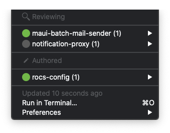
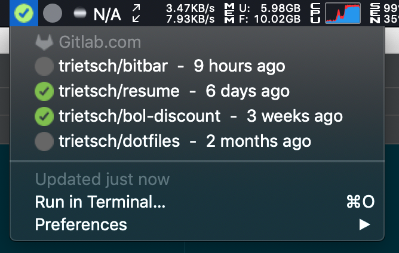

# SwiftBar scripts

Personal [SwiftBar](https://github.com/swiftbar/SwiftBar) scripts for macOS that display developer tool status in the menu bar.

## Installation

1. Install [SwiftBar](https://github.com/swiftbar/SwiftBar) and point it at the `scripts/` directory as the plugin folder.
1. Install [uv](https://github.com/astral-sh/uv): `brew install uv`
1. Copy `config/template/pull_requests-config.template` to `config/pull_requests-config.toml` and fill in your details.
1. Enable the scripts you want via SwiftBar's plugin manager — dependencies are installed automatically on first run.

## Scripts

### Pull Requests

Aggregates open pull requests from one or more platforms into a single menu bar item, showing your review status across all configured sources.

Supported platforms (configure via `enabled_pr_modules` in `pull_requests-config.toml`):

- **Azure DevOps** — `azure_devops`
- **GitLab** — `gitlab_mrs`
- **Bitbucket** (self-hosted) — `bitbucket`

#### Menu bar

The number shown in the menu bar is the total count of PRs that need your attention: open PRs assigned to you for review, plus your own PRs that have received feedback.

#### Color coding

Each PR and repository shows a status icon:

| Color | Meaning |
|---|---|
| 🟢 Green | Approved (or approved with suggestions) |
| 🟠 Orange | Needs work / waiting for author |
| ⚫ Grey | Not yet reviewed |
| 🔴 Red | Rejected |

The repository-level icon reflects the worst status across all its PRs.

#### Sections

- **Reviewing** — PRs where you are assigned as a reviewer
- **Authored** — your own PRs that have received a "needs work" or "rejected" vote

### GitLab CI

Shows the pipeline status for starred/member GitLab projects, similar to CCMenu.

### Man of the Day

Reads today's on-call person from an iCalendar feed and displays their first name in the menu bar.

